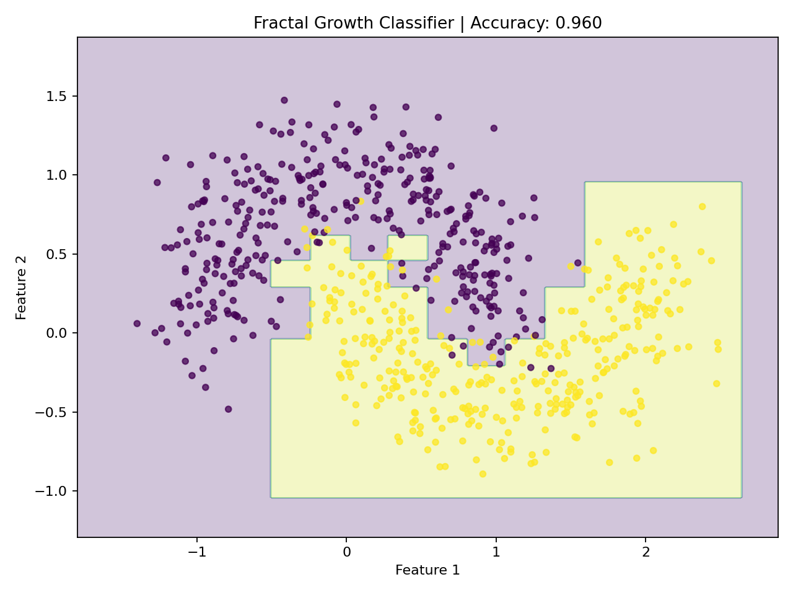
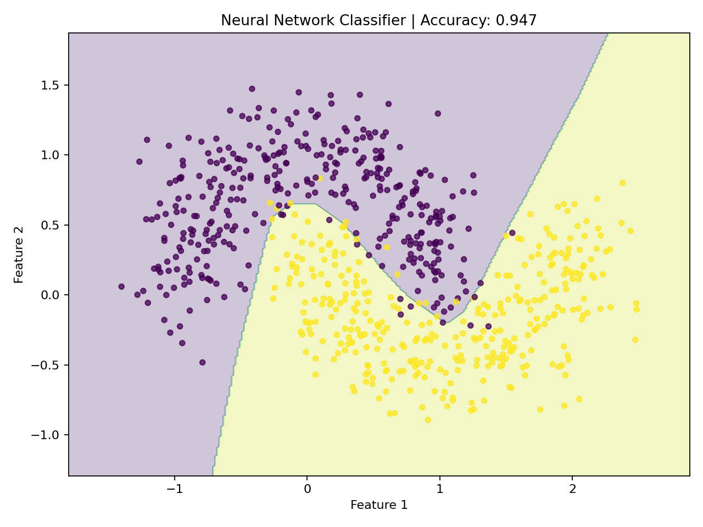
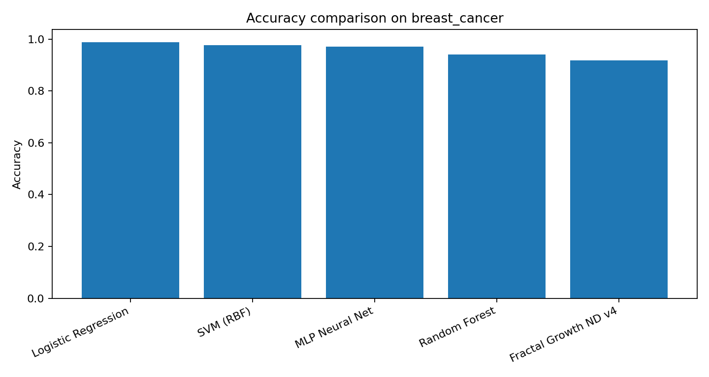
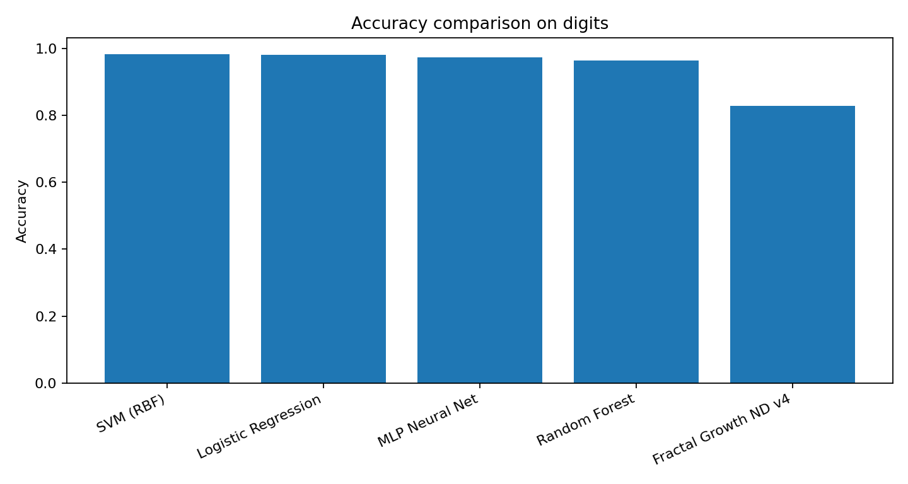
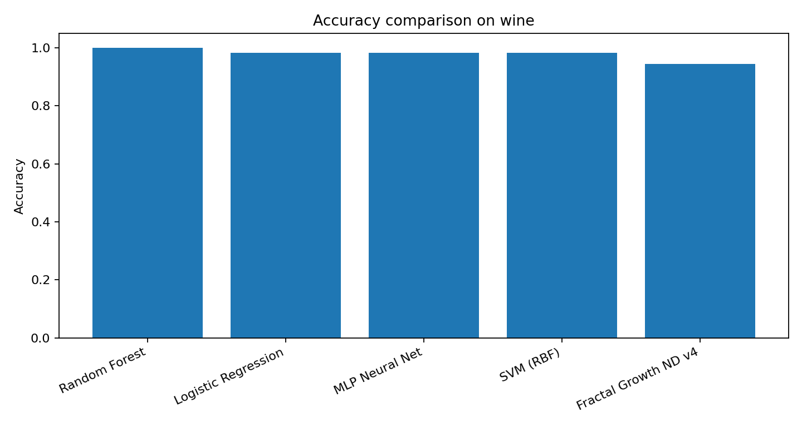

# Fractal Growth AI

Experimental AI model that learns by growing a fractal-like decision structure instead of using neural networks or backpropagation.

The current model is a **non-neural classifier** that recursively expands uncertain regions of feature space.  
Simple regions stay compressed. Complex regions grow into finer decision regions.

## Core Idea

Most neural networks learn by adjusting weights through gradient descent.

Fractal Growth AI explores a different idea:

> Can a model learn by growing the shape of a decision space instead of training neural-network weights?

The model starts with one compressed region, then repeatedly asks:

```text
Where is the data still uncertain?
Where would a split reduce class impurity the most?
Can we grow only where more detail is needed?
```

This creates an adaptive decision geometry.

## Current Version

The current version is **Fractal Growth ND v4**.

It includes:

- information-gain splitting
- smart candidate splits near class-boundary changes
- global feature preselection
- minimum-gain stopping
- no backpropagation
- no neural-network layers

## Project Status

This is an early research prototype.

It is not currently beating the best classical ML baselines in accuracy, but it shows an interesting speed/accuracy profile:

- faster than MLP neural nets in these benchmarks
- faster than Random Forest in these benchmarks
- slower than Logistic Regression and SVM
- less accurate than the strongest baselines
- visually explainable on 2D data

## Install

```bash
pip install -r requirements.txt
```

## Run 2D Demo

```bash
python examples/demo_2d.py
```

This generates visual decision boundaries:

```text
outputs/fractal_decision_boundary.png
outputs/neural_decision_boundary.png
```

## Run Benchmarks

```bash
python examples/benchmark_standard_datasets.py
```

This compares:

- Fractal Growth ND v4
- Logistic Regression
- SVM with RBF kernel
- MLP Neural Net
- Random Forest

On:

- Breast Cancer Wisconsin
- Digits
- Wine

---

# Visual Results

## 2D Toy Dataset

The fractal model creates a blocky, grown decision geometry.  
The neural net creates a smoother learned boundary.

### Fractal Growth Classifier



### Neural Network Classifier



On this toy nonlinear dataset:

| Model | Accuracy |
|---|---:|
| Fractal Growth Classifier | 0.960 |
| Neural Network Classifier | 0.947 |

This is the most intuitive demonstration of the idea: the fractal model grows local decision regions instead of forming a smooth neural boundary.

---

# Standard Benchmark Results

## Breast Cancer

### Accuracy



### Training Time


| Model | Accuracy | Train Time | Speed vs Fractal |
|---|---:|---:|---:|
| Logistic Regression | 0.9883 | 0.0065 sec | 0.25x |
| SVM (RBF) | 0.9766 | 0.0017 sec | 0.06x |
| MLP Neural Net | 0.9708 | 0.3245 sec | 12.57x slower |
| Random Forest | 0.9415 | 0.2054 sec | 7.96x slower |
| Fractal Growth ND v4 | 0.9181 | 0.0258 sec | 1.00x |

### Takeaway

Fractal Growth is less accurate than the standard baselines, but it trains much faster than MLP and Random Forest on this dataset.

---

## Digits

### Accuracy



### Training Time


| Model | Accuracy | Train Time | Speed vs Fractal |
|---|---:|---:|---:|
| SVM (RBF) | 0.9833 | 0.0185 sec | 0.14x |
| Logistic Regression | 0.9815 | 0.0220 sec | 0.16x |
| MLP Neural Net | 0.9741 | 0.6696 sec | 4.88x slower |
| Random Forest | 0.9648 | 0.3694 sec | 2.69x slower |
| Fractal Growth ND v4 | 0.8278 | 0.1372 sec | 1.00x |

### Takeaway

Digits is currently the weakest benchmark for Fractal Growth.  
The model is faster than MLP and Random Forest, but the accuracy gap is still large.

This suggests the current axis-split fractal geometry struggles with high-dimensional image-like data.

---

## Wine

### Accuracy



### Training Time


| Model | Accuracy | Train Time | Speed vs Fractal |
|---|---:|---:|---:|
| Random Forest | 1.0000 | 0.1244 sec | 13.60x slower |
| Logistic Regression | 0.9815 | 0.0028 sec | 0.31x |
| MLP Neural Net | 0.9815 | 0.1203 sec | 13.14x slower |
| SVM (RBF) | 0.9815 | 0.0009 sec | 0.10x |
| Fractal Growth ND v4 | 0.9444 | 0.0091 sec | 1.00x |

### Takeaway

Wine is the strongest standard benchmark so far.

Fractal Growth gets reasonably close to the top models while training much faster than MLP and Random Forest.

---

# Summary

## Where Fractal Growth Looks Good

Fractal Growth ND v4 is promising when:

- speed matters
- interpretability matters
- the data has local decision regions
- a blocky/adaptive geometry is acceptable
- we want non-neural training
- we want no backpropagation

## Where It Still Struggles

The current model struggles when:

- data is high-dimensional
- boundaries require smooth curves
- many features interact at once
- the best solution requires dense nonlinear representation

Digits shows this clearly.

## Current Honest Claim

The current version should not be described as a replacement for neural networks or transformers.

A better claim is:

> Fractal Growth is an experimental non-neural learning method that grows adaptive decision geometry. In early benchmarks, it is faster than MLP and Random Forest but less accurate than the strongest classical baselines.

## Research Direction

The strongest future directions are:

1. Ensemble Fractal Growth  
   Train multiple small fractal models and vote.

2. Oblique Splits  
   Split using combinations of features instead of one feature at a time.

3. Soft Boundaries  
   Blend predictions near split edges.

4. Region Merging  
   Compress similar neighboring regions after growth.

5. Better Feature Projection  
   Use PCA, random projections, or learned-free transforms before growth.

6. Retrieval / Routing  
   Use fractal growth as a routing or memory structure instead of a direct classifier.

7. LLM Helper Layer  
   Explore fractal geometry as a routing, retrieval, or memory index for transformer systems.

## Why This Is Interesting

The model is not just another neural network.

It learns by creating structure:

```text
compressed root
  → uncertain region
    → split
      → local decision region
        → further growth only where needed
```

This matches the original hypothesis:

> Intelligence may be representable as a multidimensional shape that grows from compressed form into useful structure.

## Files

```text
fractal-growth-ai/
  README.md
  requirements.txt
  .gitignore
  LICENSE

  fractal_growth/
    __init__.py
    classifier_2d.py
    classifier_nd.py

  examples/
    demo_2d.py
    benchmark_standard_datasets.py

  outputs/
    .gitkeep
```

## License

MIT
